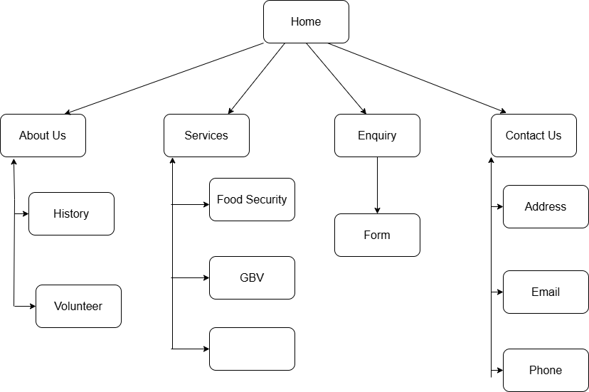

# Project Title
Website for Kolisi Foundation

## Student Information
**Student number:** ST10487376  
**Student Name:** Sibabalwe Tuntulwana

## Project Overview

Kolisi Foundation is a community- based NGO established in 2020 in Zwide, South Africa, It was founded by Siya and Rachel Kolisi, who focuses on strengthening local communities, the foundation partners with existing grassroots organisations to drive change in food security, Gender-Based violence (GBV), and Education/sports development.
•	Mission: We unite organisations to mobilise resources and strengthen infrastructure and learning. To help communities thrive, we aim to bring about systemic change through sport and education, addressing gender-based violence, and contributing to food security. We do so by partnering with organisations with a pre-existing footprint in our geographic focus areas.
•	Vision: To change the stories of inequality in South Africa, to see thriving communities
•	Target Audience: Under-resourced communities in South Africa, with a special focus on Zwide (Gqeberha) and surrounding areas. Also, children, youth, and survivors of Gender-based violence (GBV).

## Website Goals and Objectives

Goals:
•	Increase online donations and expand the monthly donor community by 35% within 12 months of a redesigned website launch.
•	Boost Engagement: Drive applications for its initiatives
•	Raise awareness about Food security, Gender-Based violence, and Education & Sport.
Key Performance Indicators:
•	Monthly unique website visitors (target: 2 000 per month within 6 months).
•	Online donation conversation rate (target: 4%).
•	Monthly donor sign-up rate (target: 100 new monthly donors per month).
•	NGO partnership enquiry form submissions (target: 10 per month).

## Timeline and Milestones

•	Week 1, 30th- 3rd April (Planning): Finalise content audit and wireframes.
•	Week 2, 6th- 10th April (Design): Develop high-fidelity mock-ups for the “Impact Dashboard”.
•	Week 3, 13th-17th April (Development): Code the core HTML/CSS structure and integrate the donation API.
•	Week 4, 20th- 24th April (Testing & Launch): Cross-browser testing and WCAG accessibility audit.

## Sitemap

   (The one here is only an example, include your own site map)

## References

•	Kolisi Foundation (2024) About Us. Available [online] at: https://kolisifoundation.org/about-us/ (Accessed: 9 April 2026)
•	Kolisi Foundation (2024) Focus Areas. Available [online] at: https://kolisifoundation.org (Accessed: 9 April 2026)
•	WordPress.org (2024) Getting Started with WordPress. Available [online] at: https://wordpress.org/support/ (Accessed: 9 April 2024)

